# Video Game Sales Analysis

## Introduction

I am interested in exploring this dataset and creating some visualizations to see how video games sales compare across these four main variables:
* Years 
* Genres
* Regions
* Publishers 

## Importing the Data and Cleaning

First I want to import the dataset and look at the first few rows to get a feel for what the data looks like.


```python
#Import relevant libraries
%matplotlib inline
import pandas as pd
import numpy as np
import matplotlib.pyplot as plt
from matplotlib.gridspec import GridSpec
import seaborn as sns

#Read CSV file
df = pd.read_csv('vgsales.csv')

#Preview the data
df.head(n=5)
```

    //anaconda/lib/python2.7/site-packages/matplotlib/font_manager.py:273: UserWarning: Matplotlib is building the font cache using fc-list. This may take a moment.
      warnings.warn('Matplotlib is building the font cache using fc-list. This may take a moment.')


<div>
<table border="1" class="dataframe">
  <thead>
    <tr style="text-align: right;">
      <th></th>
      <th>Rank</th>
      <th>Name</th>
      <th>Platform</th>
      <th>Year</th>
      <th>Genre</th>
      <th>Publisher</th>
      <th>NA_Sales</th>
      <th>EU_Sales</th>
      <th>JP_Sales</th>
      <th>Other_Sales</th>
      <th>Global_Sales</th>
    </tr>
  </thead>
  <tbody>
    <tr>
      <th>0</th>
      <td>1</td>
      <td>Wii Sports</td>
      <td>Wii</td>
      <td>2006.0</td>
      <td>Sports</td>
      <td>Nintendo</td>
      <td>41.49</td>
      <td>29.02</td>
      <td>3.77</td>
      <td>8.46</td>
      <td>82.74</td>
    </tr>
    <tr>
      <th>1</th>
      <td>2</td>
      <td>Super Mario Bros.</td>
      <td>NES</td>
      <td>1985.0</td>
      <td>Platform</td>
      <td>Nintendo</td>
      <td>29.08</td>
      <td>3.58</td>
      <td>6.81</td>
      <td>0.77</td>
      <td>40.24</td>
    </tr>
    <tr>
      <th>2</th>
      <td>3</td>
      <td>Mario Kart Wii</td>
      <td>Wii</td>
      <td>2008.0</td>
      <td>Racing</td>
      <td>Nintendo</td>
      <td>15.85</td>
      <td>12.88</td>
      <td>3.79</td>
      <td>3.31</td>
      <td>35.82</td>
    </tr>
    <tr>
      <th>3</th>
      <td>4</td>
      <td>Wii Sports Resort</td>
      <td>Wii</td>
      <td>2009.0</td>
      <td>Sports</td>
      <td>Nintendo</td>
      <td>15.75</td>
      <td>11.01</td>
      <td>3.28</td>
      <td>2.96</td>
      <td>33.00</td>
    </tr>
    <tr>
      <th>4</th>
      <td>5</td>
      <td>Pokemon Red/Pokemon Blue</td>
      <td>GB</td>
      <td>1996.0</td>
      <td>Role-Playing</td>
      <td>Nintendo</td>
      <td>11.27</td>
      <td>8.89</td>
      <td>10.22</td>
      <td>1.00</td>
      <td>31.37</td>
    </tr>
  </tbody>
</table>
</div>


Now I'm going to take a look at what type of data we have.


```python
#View information on data
df.info()
```

    <class 'pandas.core.frame.DataFrame'>
    RangeIndex: 16598 entries, 0 to 16597
    Data columns (total 11 columns):
    Rank            16598 non-null int64
    Name            16598 non-null object
    Platform        16598 non-null object
    Year            16327 non-null float64
    Genre           16598 non-null object
    Publisher       16540 non-null object
    NA_Sales        16598 non-null float64
    EU_Sales        16598 non-null float64
    JP_Sales        16598 non-null float64
    Other_Sales     16598 non-null float64
    Global_Sales    16598 non-null float64
    dtypes: float64(6), int64(1), object(4)
    memory usage: 1.4+ MB


It looks like we may have some null values so I want to check which variables are missing values.


```python
#Check for null values
df.isnull().any()
```


    Rank            False
    Name            False
    Platform        False
    Year             True
    Genre           False
    Publisher        True
    NA_Sales        False
    EU_Sales        False
    JP_Sales        False
    Other_Sales     False
    Global_Sales    False
    dtype: bool


'Year' and 'Publisher' are missing values so I want to check just how many values we're missing and drop them.


```python
#Counting how many NaN values
print 'Year of Release NaN:', df['Year'].isnull().sum()
print 'Publisher NaN:', df['Publisher'].isnull().sum()

#Removing NaN values
df = df.dropna()
```

    Year of Release NaN: 271
    Publisher NaN: 58


## General Analysis
Now I want to look at some general statistics on sales across the different regions and global sales.


```python
#Descriptive statistics
df.loc[:,'NA_Sales':'Global_Sales'].describe()
```


<div>
<table border="1" class="dataframe">
  <thead>
    <tr style="text-align: right;">
      <th></th>
      <th>NA_Sales</th>
      <th>EU_Sales</th>
      <th>JP_Sales</th>
      <th>Other_Sales</th>
      <th>Global_Sales</th>
    </tr>
  </thead>
  <tbody>
    <tr>
      <th>count</th>
      <td>16291.000000</td>
      <td>16291.000000</td>
      <td>16291.000000</td>
      <td>16291.000000</td>
      <td>16291.000000</td>
    </tr>
    <tr>
      <th>mean</th>
      <td>0.265647</td>
      <td>0.147731</td>
      <td>0.078833</td>
      <td>0.048426</td>
      <td>0.540910</td>
    </tr>
    <tr>
      <th>std</th>
      <td>0.822432</td>
      <td>0.509303</td>
      <td>0.311879</td>
      <td>0.190083</td>
      <td>1.567345</td>
    </tr>
    <tr>
      <th>min</th>
      <td>0.000000</td>
      <td>0.000000</td>
      <td>0.000000</td>
      <td>0.000000</td>
      <td>0.010000</td>
    </tr>
    <tr>
      <th>25%</th>
      <td>0.000000</td>
      <td>0.000000</td>
      <td>0.000000</td>
      <td>0.000000</td>
      <td>0.060000</td>
    </tr>
    <tr>
      <th>50%</th>
      <td>0.080000</td>
      <td>0.020000</td>
      <td>0.000000</td>
      <td>0.010000</td>
      <td>0.170000</td>
    </tr>
    <tr>
      <th>75%</th>
      <td>0.240000</td>
      <td>0.110000</td>
      <td>0.040000</td>
      <td>0.040000</td>
      <td>0.480000</td>
    </tr>
    <tr>
      <th>max</th>
      <td>41.490000</td>
      <td>29.020000</td>
      <td>10.220000</td>
      <td>10.570000</td>
      <td>82.740000</td>
    </tr>
  </tbody>
</table>
</div>


From this information we can see that North America makes up almost half of all video game sales.

Next I'm going to see what the top 25 all-time best-selling games are.


```python
#Top 25 best-selling video games by global sales copies
df.groupby(['Name']).sum()['Global_Sales'].sort_values(ascending=False)[:25]
```


    Name
    Wii Sports                        82.74
    Grand Theft Auto V                55.92
    Super Mario Bros.                 45.31
    Tetris                            35.84
    Mario Kart Wii                    35.82
    Wii Sports Resort                 33.00
    Pokemon Red/Pokemon Blue          31.37
    Call of Duty: Modern Warfare 3    30.83
    New Super Mario Bros.             30.01
    Call of Duty: Black Ops II        29.72
    Call of Duty: Black Ops           29.40
    Wii Play                          29.02
    New Super Mario Bros. Wii         28.62
    Duck Hunt                         28.31
    Call of Duty: Ghosts              27.38
    Super Mario World                 26.07
    Call of Duty: Black Ops 3         25.32
    Call of Duty: Modern Warfare 2    25.09
    Nintendogs                        24.76
    Grand Theft Auto: San Andreas     23.86
    Minecraft                         23.73
    Mario Kart DS                     23.42
    Pokemon Gold/Pokemon Silver       23.10
    Wii Fit                           22.72
    Super Mario Bros. 3               22.48
    Name: Global_Sales, dtype: float64


The games that seem to frequent the top 25 best-selling games are Wii Sports/Fit, Mario, and Call of Duty.

Let's see how sales have been doing over the years.


```python
#Plotting sales copies by year
global_sales_by_year = df[df['Year'] <= 2016.0].groupby(['Year']).sum()['Global_Sales']
plt.figure(figsize=(8,5))
sns.barplot(y = global_sales_by_year.values, x = global_sales_by_year.index, palette = "PuBu")
plt.xticks(rotation = 70)
plt.title('Copies Sold by Year')
plt.ylabel('Global Copies Sold in Millions')
plt.xlabel('Year')
plt.show()
```


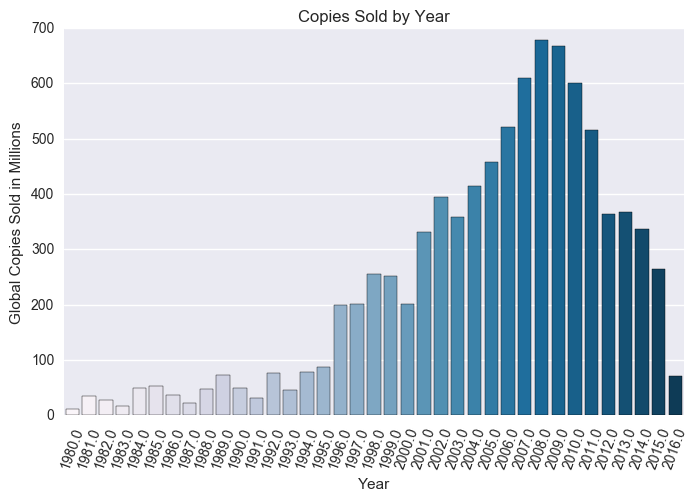


It looks like there was a climb in sales until they peaked in 2008, and sales have been dropping since.

I wonder how video games sales have performed in each region.


```python
NA_sales_by_year = df[df['Year'] <= 2016.0].groupby(['Year']).sum()['NA_Sales']
EU_sales_by_year = df[df['Year'] <= 2016.0].groupby(['Year']).sum()['EU_Sales']
JP_sales_by_year = df[df['Year'] <= 2016.0].groupby(['Year']).sum()['JP_Sales']
other_sales_by_year = df[df['Year'] <= 2016.0].groupby(['Year']).sum()['Other_Sales']

the_grid = GridSpec(2, 2)
the_grid.update(left=.01, right=2, wspace=0.1)

plt.subplot(the_grid[0, 0])
sns.barplot(y = NA_sales_by_year.values, x = NA_sales_by_year.index, palette = "PuBu")
plt.title('NA Sales')
plt.axis('off')

plt.subplot(the_grid[0, 1])
sns.barplot(y = EU_sales_by_year.values, x = EU_sales_by_year.index, palette = "PuBu")
plt.title('EU Sales')
plt.axis('off')

plt.subplot(the_grid[1, 0])
sns.barplot(y = JP_sales_by_year.values, x = JP_sales_by_year.index, palette = "PuBu")
plt.title('JP Sales')
plt.axis('off')

plt.subplot(the_grid[1, 1])
sns.barplot(y = other_sales_by_year.values, x = other_sales_by_year.index, palette = "PuBu")
plt.title('Other Sales')
plt.axis('off')

plt.show()
```


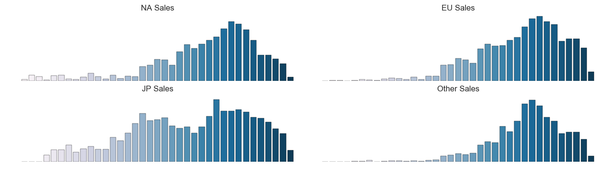


It's interesting to see that NA, EU, and Other sales have generally followed the same trend as global sales, but Japan follows a different distribution.

## Genre Sales Analysis

Now I want to take a look at how each genre fares in the video game industry. First I'll take a look at overall global sales for all of the genres.


```python
#Plotting global sales copies by genre
sales_by_genre = df.groupby(['Genre']).sum()['Global_Sales'].sort_values(ascending = False)
plt.figure(figsize=(8,5))
sns.barplot(y = sales_by_genre.index, x = sales_by_genre.values, palette = "PuBu_r")
plt.title('Copies Sold by Genre')
plt.xlabel('Global Copies Sold in Millions')
plt.ylabel('Genre')
plt.show()
```


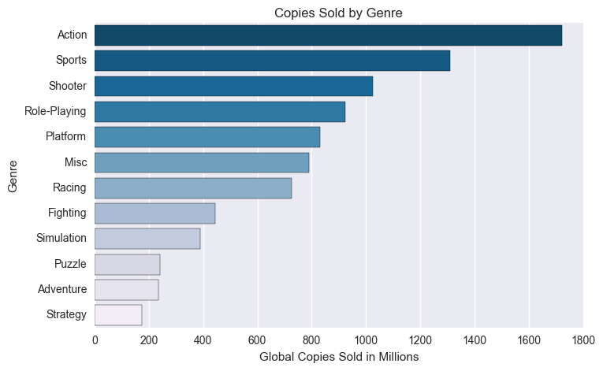


Action, Sports, and Shooter have performed the best but I would be interested to see how the genres sales compare over the years. To visualize this, I will use a heatmap.


```python
#Heatmap of sales copies by genre and year
genre_year_table = pd.pivot_table(df[df['Year'] <= 2016.0], values = ['Global_Sales'], index = ['Year'], columns = ['Genre'], aggfunc = 'sum')

plt.figure(figsize=(10,8))
sns.heatmap(genre_year_table['Global_Sales'], annot = True, annot_kws = {"size": 8}, fmt = 'g', cmap = "PuBu")
plt.xticks(rotation = 70)
plt.title('Copies Sold (in Millions) by Year and Genre')
plt.xlabel('Genre')
plt.ylabel('Year')
plt.show()
```


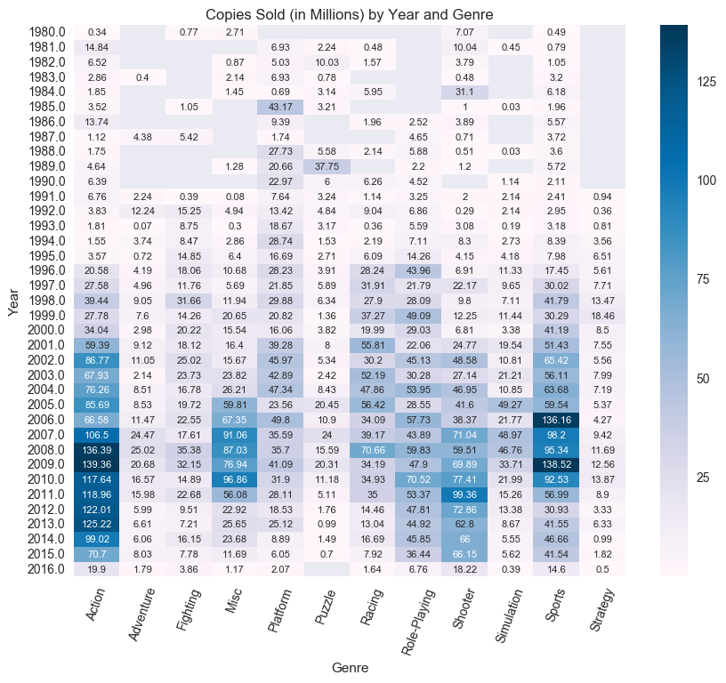


Action games continue to stay on top but it looks like shooter games are starting to gain speed over sports games in recent years.

Next I want to look at how each region contributes to the overall sales of each genre.


```python
#Plotting genre sales copies by region
NA_sales_by_genre = df.groupby(['Genre']).sum()['NA_Sales']
EU_sales_by_genre = df.groupby(['Genre']).sum()['EU_Sales']
JP_sales_by_genre = df.groupby(['Genre']).sum()['JP_Sales']
other_sales_by_genre = df.groupby(['Genre']).sum()['Other_Sales']

N = 12
ind = np.arange(N)
width = 0.75

NA_sales_plot = plt.bar(ind,NA_sales_by_genre.values, width, color = '#0570b0', label = "NA Sales")
EU_sales_plot = plt.bar(ind,EU_sales_by_genre.values, width, bottom = NA_sales_by_genre.values, color = '#74a9cf', label = "EU Sales")
JP_sale_plot = plt.bar(ind,JP_sales_by_genre.values, width, bottom = EU_sales_by_genre.values + NA_sales_by_genre.values, color = '#bdc9e1', label = "JP Sales")
other_sales_plot = plt.bar(ind,other_sales_by_genre.values, width, bottom = JP_sales_by_genre.values + EU_sales_by_genre.values + NA_sales_by_genre.values, color = '#f1eef6', label = "Other Sales")

plt.xticks(ind + width/2., NA_sales_by_genre.index, rotation = 70)
plt.title('Copies Sold by Genre and Region')
plt.xlabel('Genre')
plt.ylabel('Copies Sold in Millions')
plt.legend(bbox_to_anchor=(1.05,1), loc=2, borderaxespad=0)
plt.show()
```


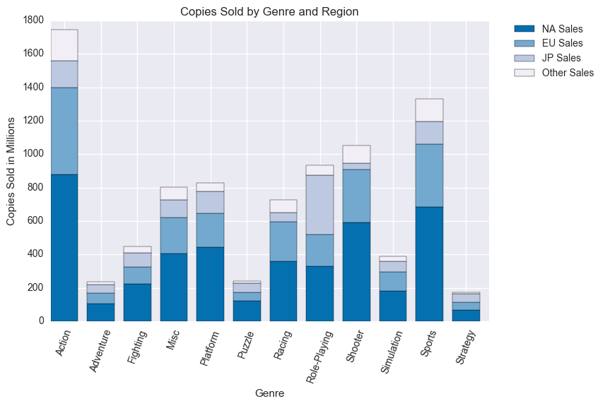


Since it's difficult to compare with the different heights of the bars, I will normalize the data.


```python
#Plotting genre sales copies proportions
NA_sales_prop = NA_sales_by_genre / sales_by_genre
EU_sales_prop = EU_sales_by_genre / sales_by_genre
JP_sales_prop = JP_sales_by_genre / sales_by_genre
other_sales_prop = other_sales_by_genre / sales_by_genre

NA_prop = plt.bar(ind,NA_sales_prop.values, width, color = '#0570b0', label = "NA Sales")
EU_prop = plt.bar(ind,EU_sales_prop.values, width, bottom = NA_sales_prop.values, color = '#74a9cf', label = "EU Sales")
JP_prop = plt.bar(ind,JP_sales_prop.values, width, bottom = EU_sales_prop.values + NA_sales_prop.values, color = '#bdc9e1', label = "JP Sales")
other_prop = plt.bar(ind,other_sales_prop.values, width, bottom = JP_sales_prop.values + EU_sales_prop.values + NA_sales_prop.values, color = '#f1eef6', label = "Other Sales")

plt.xticks(ind + width/2., NA_sales_prop.index, rotation = 70)
plt.title('Proportionate Copies Sold by Genre and Region')
plt.xlabel('Genre')
plt.ylabel('Proportion of Copies Sold')
plt.legend(bbox_to_anchor=(1.05,1), loc=2, borderaxespad=0)
plt.show()
```


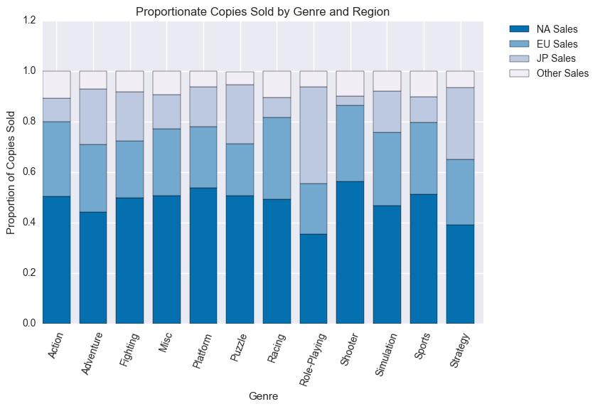


What shocked me the most is Japan's interests compared to the rest of the world's. In the top three genres of Action, Sports, and Shooter, Japan has very little interest while the country makes up a large portion of Role-Playing sales. 

I will also look at a heatmap to compare genre sales across the regions.


```python
#Heatmap of sales copies by region and genre
genre_region = df.groupby(['Genre']).sum().loc[:,'NA_Sales':'Other_Sales']

plt.figure(figsize=(8,4))
sns.heatmap(genre_region.loc[:,'NA_Sales':'Other_Sales'], annot = True, annot_kws = {"size": 8}, fmt = 'g', cmap = "PuBu")
plt.title('Copies Sold (in Millions) by Genre and Region')
plt.xlabel('Region')
plt.ylabel('Genre')
plt.show()
```


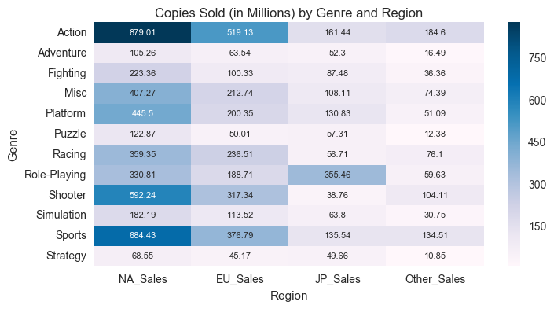


North America and Europe show the same trend of top sales in Action, Sports, and Shooter respectively while Japan's top-selling genre is Role-Playing.

## Publisher Sales Analysis

In this section I'll take a look at how publishers perform in the industry. First I'll see which publishers have released the most number of games.


```python
#Plotting top 10 publishers by number of games released
games_by_publisher = df.groupby(['Publisher']).count()['Name'].sort_values(ascending=False)[:10]
plt.figure(figsize=(8,5))
sns.barplot(y = games_by_publisher.index, x = games_by_publisher.values, palette = "PuBu_r")
plt.title('Number of Games Released by Publisher')
plt.xlabel('Number of Games')
plt.ylabel('Publisher')
plt.show()
```


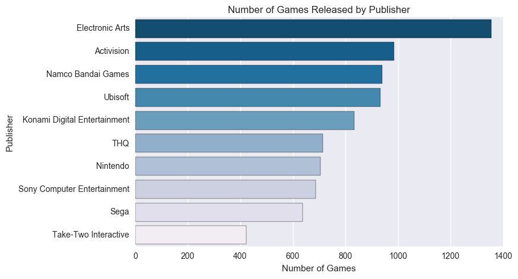


Electronic Arts has release the most number of games over the years but I want to see how this affects their sales.


```python
#Plotting top 10 publishers by sales copies
sales_by_publisher = df.groupby(['Publisher']).sum()['Global_Sales'].sort_values(ascending = False)[:10]
plt.figure(figsize=(8,5))
sns.barplot(y = sales_by_publisher.index, x = sales_by_publisher.values, palette = "PuBu_r")
plt.title('Copies Sold by Publisher')
plt.xlabel('Global Copies Sold in Millions')
plt.ylabel('Publisher')
plt.show()
```


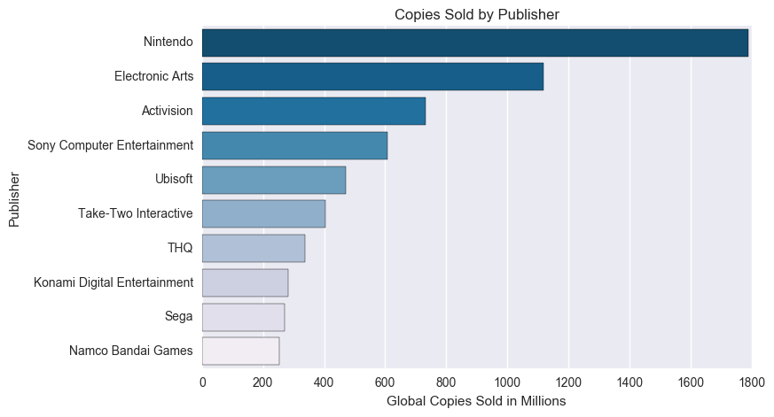


Although Nintendo is only seventh in the number of games released, it still holds the top spot in most sales (almost double the sales of Electronic Arts). This makes me wonder which publishers have the best return based on how many games they've released.


```python
#Plotting sales copies per game released by publisher
num_games = df.groupby(['Publisher']).count()['Name']
sales_rev = df.groupby(['Publisher']).sum()['Global_Sales']
revenue_per_game = (sales_rev / num_games).sort_values(ascending = False)[:10]

plt.figure(figsize=(8,5))
sns.barplot(y = revenue_per_game.index, x = revenue_per_game.values, palette = "PuBu_r")
plt.title('Copies Sold per Game Released by Publisher')
plt.xlabel('Copies Sold per Game Released in Millions')
plt.ylabel('Publisher')
plt.show()
```


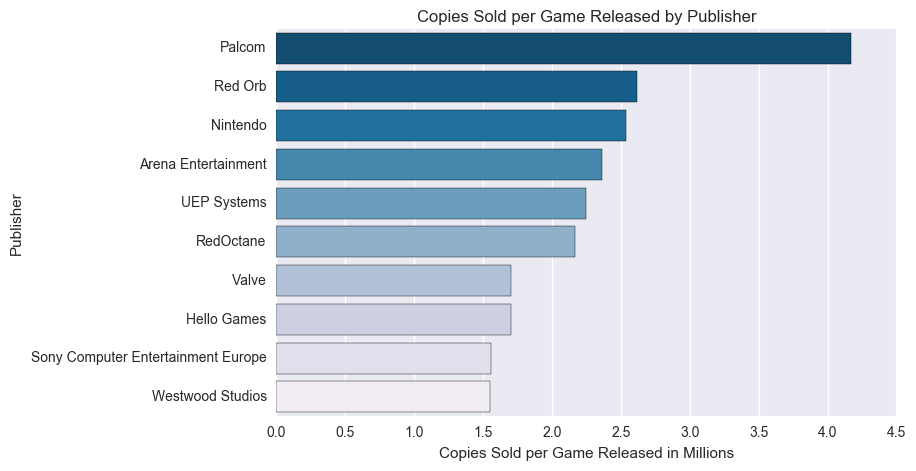


Out of the top 10 publishers by sales, only Nintendo appears on this list. I wonder how the publishers have performed over the years though. Is Nintendo still number 1?


```python
#Heatmap of sales copies by publisher and year
top_10_pub = df.groupby(['Publisher']).sum()['Global_Sales'].sort_values(ascending = False)[:10]
publisher_year_table = pd.pivot_table(df[df['Publisher'].isin(top_10_pub.index)][df['Year'] <= 2016.0], values = ['Global_Sales'], index = ['Year'], columns = ['Publisher'], aggfunc = 'sum')

plt.figure(figsize=(10,8))
sns.heatmap(publisher_year_table['Global_Sales'], annot = True, annot_kws = {"size": 8}, fmt = 'g', cmap = "PuBu")
plt.xticks(rotation = 70)
plt.title('Copies Sold (in Millions) by Year and Publisher')
plt.xlabel('Publisher')
plt.ylabel('Year')
plt.show()
```

    /anaconda/lib/python2.7/site-packages/ipykernel/__main__.py:3: UserWarning: Boolean Series key will be reindexed to match DataFrame index.
      app.launch_new_instance()


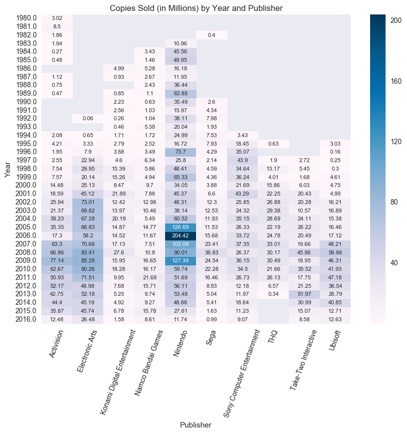


Nintendo peaked in 2006 but it looks like Electronic Arts has been taking over in the past few years. I want to take a look at what Nintendo released in 2006.


```python
df[df['Publisher'] == 'Nintendo'][df['Year'] == 2006][:5]
```

    /anaconda/lib/python2.7/site-packages/ipykernel/__main__.py:1: UserWarning: Boolean Series key will be reindexed to match DataFrame index.
      if __name__ == '__main__':


<div>
<table border="1" class="dataframe">
  <thead>
    <tr style="text-align: right;">
      <th></th>
      <th>Rank</th>
      <th>Name</th>
      <th>Platform</th>
      <th>Year</th>
      <th>Genre</th>
      <th>Publisher</th>
      <th>NA_Sales</th>
      <th>EU_Sales</th>
      <th>JP_Sales</th>
      <th>Other_Sales</th>
      <th>Global_Sales</th>
    </tr>
  </thead>
  <tbody>
    <tr>
      <th>0</th>
      <td>1</td>
      <td>Wii Sports</td>
      <td>Wii</td>
      <td>2006.0</td>
      <td>Sports</td>
      <td>Nintendo</td>
      <td>41.49</td>
      <td>29.02</td>
      <td>3.77</td>
      <td>8.46</td>
      <td>82.74</td>
    </tr>
    <tr>
      <th>6</th>
      <td>7</td>
      <td>New Super Mario Bros.</td>
      <td>DS</td>
      <td>2006.0</td>
      <td>Platform</td>
      <td>Nintendo</td>
      <td>11.38</td>
      <td>9.23</td>
      <td>6.50</td>
      <td>2.90</td>
      <td>30.01</td>
    </tr>
    <tr>
      <th>7</th>
      <td>8</td>
      <td>Wii Play</td>
      <td>Wii</td>
      <td>2006.0</td>
      <td>Misc</td>
      <td>Nintendo</td>
      <td>14.03</td>
      <td>9.20</td>
      <td>2.93</td>
      <td>2.85</td>
      <td>29.02</td>
    </tr>
    <tr>
      <th>20</th>
      <td>21</td>
      <td>Pokemon Diamond/Pokemon Pearl</td>
      <td>DS</td>
      <td>2006.0</td>
      <td>Role-Playing</td>
      <td>Nintendo</td>
      <td>6.42</td>
      <td>4.52</td>
      <td>6.04</td>
      <td>1.37</td>
      <td>18.36</td>
    </tr>
    <tr>
      <th>100</th>
      <td>101</td>
      <td>The Legend of Zelda: Twilight Princess</td>
      <td>Wii</td>
      <td>2006.0</td>
      <td>Action</td>
      <td>Nintendo</td>
      <td>3.83</td>
      <td>2.19</td>
      <td>0.60</td>
      <td>0.70</td>
      <td>7.31</td>
    </tr>
  </tbody>
</table>
</div>


Nintendo released Wii Sports in 2006, which is the all-time best selling game in history.

Next I'll look at which genres the publishers specialize in.


```python
#Heatmap of sales copies by publisher and genre
publisher_genre_table = pd.pivot_table(df[df['Publisher'].isin(top_10_pub.index)][df['Year'] <= 2016.0], values = ['Global_Sales'], index = ['Genre'], columns = ['Publisher'], aggfunc = 'sum')

plt.figure(figsize=(10,4))
sns.heatmap(publisher_genre_table['Global_Sales'], annot = True, annot_kws = {"size": 8}, fmt = 'g', cmap = "PuBu")
plt.xticks(rotation = 70)
plt.title('Copies Sold (in Millions) by Genre and Publisher (Top 10)')
plt.xlabel('Publisher')
plt.ylabel('Genre')
plt.show()
```

    /anaconda/lib/python2.7/site-packages/ipykernel/__main__.py:2: UserWarning: Boolean Series key will be reindexed to match DataFrame index.
      from ipykernel import kernelapp as app


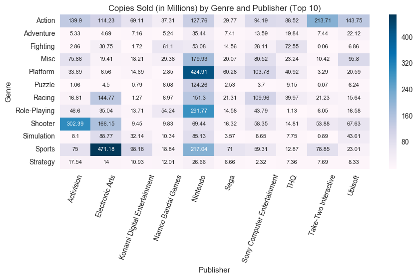


Although Action is the top-selling genre, none of the top 3 publishers with the most sales specializes in it. Nintendo primarily releases platform games, while Electronic Arts and Activision release Sports and Shooter games respectively.

How do the publishers fare per region?


```python
#Heatmap of sales copies by region and publisher
publisher_region = df[df['Publisher'].isin(top_10_pub.index)].groupby(['Publisher']).sum().loc[:,'NA_Sales':'Other_Sales']

plt.figure(figsize=(8,4))
sns.heatmap(publisher_region.loc[:,'NA_Sales':'Other_Sales'], annot = True, annot_kws = {"size": 8}, fmt = 'g', cmap = "PuBu")
plt.title('Copies Sold (in Millions) by Publisher (Top 10) and Region')
plt.xlabel('Region')
plt.ylabel('Publisher')
plt.show()
```


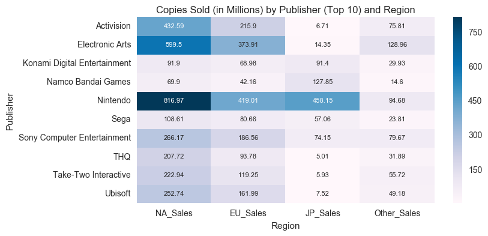


Activision and Electronic Arts perform very well in North America and Europe, but poorly in Japan. This could be due to the fact that these two publishers have strong Sports and Shooter games, which Japan is not interested in. Nintendo performs well in Japan as it releases a lot of strong role-playing games, which Japan loves.

# Conclusion
## Genre

* The top three genres are Action, Sports, and Shooter respectively. 
* Although Action continues to be the number one seller, in recent years the Shooter genre has been beating out Sports in number of sales.
* North America and Europe both share the same top-selling genres, but Japan's top-selling genre is Role-Playing.

## Publisher

* Electronic Arts has released the most games out of any publisher, but Nintendo still holds the number one spot for most games sold. 
* The top 3 publishers, by sales, are Nintendo, Electronic Arts, and Activision respectively.
* However in recent years Electronic Arts has been outpacing the other publishers in number of sales.
* Nintendo's most successful year was in 2006, and it was due to the release of Wii Sports, which is the number one best-selling game
* Electronic Arts and Activision have top sales in Sports and Shooter games respectively, which are the two of the three most popular genres in North America and Europe. Thus Electronic Arts and Activision perform better in those two regions than they do in Japan.
* Nintendo stands out in Japan because of their strong role-playing games.


```python

```
